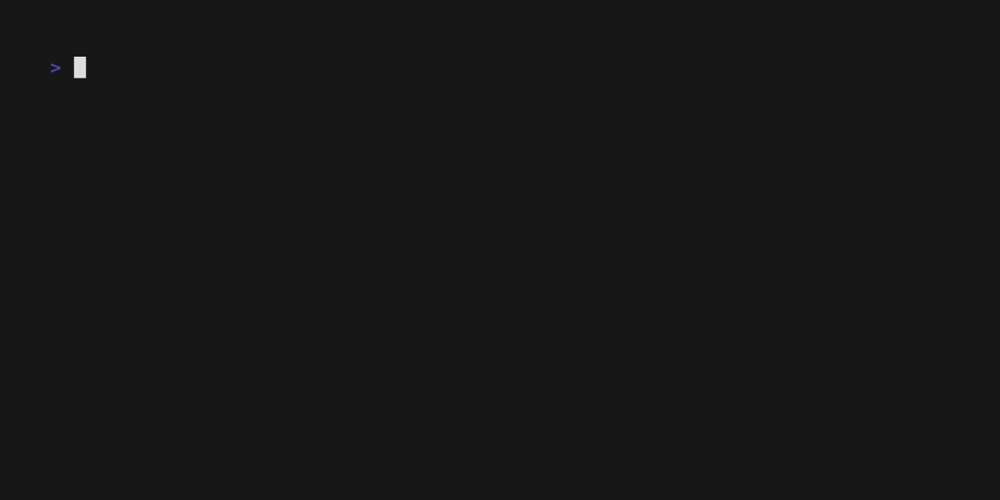

# Eggella
[ENG](README.md) [RU](README_RU.md)
> [Eggella](https://en.wikipedia.org/wiki/Eggella) is a shield volcano in central Kamchatka. 
> The volcano is located on the west axis of the southern Sredinny Range.

----
## About

Eggella is a framework for easy creating REPL applications. 

Design inspired by [vulcano](https://github.com/dgarana/vulcano) and various chatbots frameworks 
and built top on [prompt-toolkit](https://github.com/prompt-toolkit/python-prompt-toolkit)

## Features:

- Python 3.8+ support
- Command line arguments auto cast from function annotations
- Cross-platform ([prompt-toolkit guarantees](https://github.com/prompt-toolkit/python-prompt-toolkit#prompt_toolkit-features))
- FSM (finite state machine) to organize a branch interface system
- Error handlers
- Customized events
- Auto create auto suggest commands completer
- Auto generate help, and man page

## Install

```shell
pip install eggella
```

## Hello world
```python
from eggella import Eggella


app = Eggella(__name__)


@app.on_command()
def hello():
    """print `Hello, world!`"""
    return "Hello, world!"


if __name__ == '__main__':
    app.loop()
```



See the [documentation](https://eggella.readthedocs.io/en/latest/) and [examples](examples)!