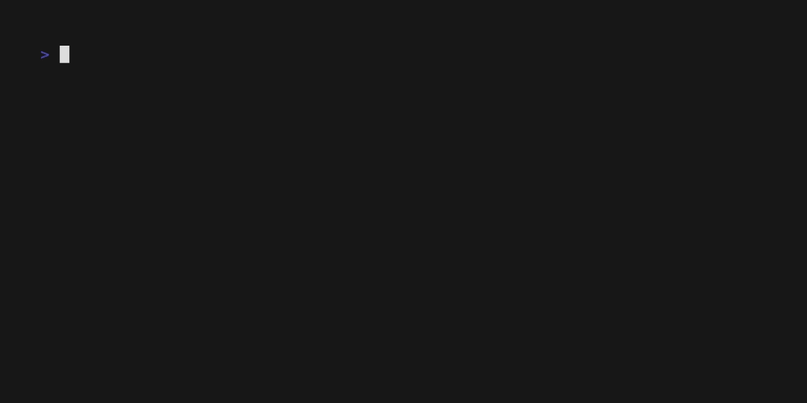

# Tutorial
In this tutorial we will write a "guess game".

## Prepare
First, let's define the project plan:

1. The `start` command starts the game. The game must be configured: 
   - set the range of numbers (minimum and maximum)
   - set the attempts count
2. The game generates a random number in the given range and the game starts
3. If the player inputs a number less than the generated number - notifies
4. If the player inputs a number greater than the generated number - notifies
5. If the attempts are over - display a message about the defeat
6. If the player guessed the number - display a victory message and exit to the main menu
7. Keep statistics of wins and losses (display with the `stats` command)

> Optional: you can save game statistics to a json file, for example

Scheme:
```
    start (start_num: int, end_num: int, attemps: int)
          |
          v
      Generate number (<digit>)
          |
          v
        Guess game (<attemps>)
           |
           v
          Input()
             |
     True    V      False       
    ----- Correct?  ---------
    |                       |
    v               True    v           False
  Increase win     ------<attemps> == 0? -------
   counter         |                           |
    |              |                   True    |                   False
    v           Increase              -------Bigger than <digit>? -----
   Exit         Draw counter          |                               |
                                      v                               v
                                    print                            print 
                                      |                               |
                                      v                               v
                                    decrease                       decrease
                                    attempts                       attempts
                                      |                                |
                                      v                                V
                                   GOTO Input()                    GOTO Input() 
```             

## Start coding
Let's add states and work logic. We will write the preliminary settings in the `app.CTX`:
```python
import random

from eggella import Eggella
from eggella.fsm import IntStateGroup


class GameStates(IntStateGroup):
    GAME = 1


app = Eggella("Guess game")
app.register_states(GameStates)


@app.on_command()
def start(start_num: int = 0, end_num: int = 10, attempts: int = 3):
    """Start guess game"""
    print(f"Game configuration: numbers range: {start_num}-{end_num} attempts: {attempts}")
    app.CTX["game"] = {
        "attempts": attempts,
        "digit": random.randint(start_num, end_num),
    }
    app.fsm.run(GameStates)


@app.on_state(GameStates.GAME)
def game():
    if app.CTX["game"]["attempts"] == 0:
        print("You lose!")
        return app.fsm.finish()

    count = app.CTX["game"]["attempts"]
    value = app.cmd.prompt(f"[{count}]Enter number -> ")
    value = int(value)

    if value == app.CTX["game"]["digit"]:
        print("You win!")
        return app.fsm.finish()
    elif value > app.CTX["game"]["digit"]:
        app.CTX["game"]["attempts"]-=1
        print("Input should be less")
        return app.fsm.set(GameStates.GAME)
    else:
        app.CTX["game"]["attempts"]-=1
        print("Input should be bigger")
        return app.fsm.set(GameStates.GAME)


if __name__ == '__main__':
    app.loop()

```



Minimal game logic ready, but there are problems:
1. No number input validation
2. Statistics not implemented
3. prompt_toolkit allows for prettier output

Add [validator](https://python-prompt-toolkit.readthedocs.io/en/master/pages/asking_for_input.html#input-validation)
and record statistics. 
Also, in addition, for example, a preliminary exit from the game and a restart will be added.

```python
import random

from prompt_toolkit.validation import Validator
from prompt_toolkit import HTML

from eggella import Eggella
from eggella.fsm import IntStateGroup


class GameStates(IntStateGroup):
    GAME = 1
    WIN = 2
    LOSE = 3
    EXIT = 4
    RESTART = 5


app = Eggella("Guess game")
app.register_states(GameStates)

NUMBER_VALIDATOR = Validator.from_callable(
    lambda s: s.isdigit() or s in ("q", "r"), error_message="Should be number or `q, r`"
)

# game stats
app.CTX["stats"] = {"win": 0, "lose": 0}


@app.on_command()
def start(start_num: int = 0, end_num: int = 10, attempts: int = 3):
    """Start guess game"""
    print(f"Game configuration: numbers range: {start_num}-{end_num} attempts: {attempts}")
    app.CTX["game"] = {
        "num_range": (start_num, end_num),
        "attempts_cfg": attempts,
        "attempts": attempts,
        "digit": random.randint(start_num, end_num),
    }
    app.fsm.run(GameStates)


@app.on_state(GameStates.GAME)
def game():
    if app.CTX["game"]["attempts"] == 0:
        print("You lose!")
        return app.fsm.set(GameStates.LOSE)

    count = app.CTX["game"]["attempts"]
    value = app.cmd.prompt(f"[{count}]Enter number -> ", validator=NUMBER_VALIDATOR)
    if value == "q":
        return app.fsm.set(GameStates.EXIT)
    elif value == "r":
        return app.fsm.set(GameStates.RESTART)

    value = int(value)

    if value == app.CTX["game"]["digit"]:
        return app.fsm.set(GameStates.WIN)
    elif value > app.CTX["game"]["digit"]:
        app.CTX["game"]["attempts"] -= 1
        app.cmd.print_ft(HTML("<ansired>Input should be less</ansired>"))
        return app.fsm.set(GameStates.GAME)
    else:
        app.CTX["game"]["attempts"] -= 1
        app.cmd.print_ft(HTML("<ansired>Input should be bigger</ansired>"))
        return app.fsm.set(GameStates.GAME)


@app.on_state(GameStates.EXIT)
def _exit_game():
    if app.cmd.confirm("Exit from game? You will be credited with defeat"):
        app.cmd.print_ft(HTML("<ansired>Manual exit game, Defeated</ansired>"))
        app.CTX["stats"]["lose"] += 1
        return app.fsm.finish()
    return app.fsm.set(GameStates.GAME)


@app.on_state(GameStates.RESTART)
def _restart_game():
    if app.cmd.confirm("Restart game? You will be credited with defeat"):
        app.cmd.print_ft(HTML("<ansired>Restart game, Defeated</ansired>"))
        app.CTX["stats"]["lose"] += 1
        app.CTX["game"]["digit"] = random.randint(*app.CTX["game"]["num_range"])
        app.CTX["game"]["attempts"] = app.CTX["game"]["attempts_cfg"]
        return app.fsm.set(GameStates.GAME)
    return app.fsm.set(GameStates.GAME)


@app.on_state(GameStates.LOSE)
def _lose_game():
    app.cmd.prompt(HTML(f"<ansired>Defeated</ansired> Correct answer {app.CTX['game']['digit']}"))
    app.CTX["stats"]["lose"] += 1
    return app.fsm.finish()


@app.fsm.state(GameStates.WIN)
def _win_game():
    app.cmd.prompt(HTML("<ansigreen>Winner winner, chicken dinner!</ansigreen>"))
    app.CTX["stats"]["win"] += 1
    return app.fsm.finish()


@app.on_command("stats")
def show_stats():
    """show game session stats"""
    win = app.CTX["stats"]["win"]
    lose = app.CTX["stats"]["lose"]
    app.cmd.print_ft(HTML(f"Wins: <ansigreen>{win}</ansigreen>\nDefeats: <ansired>{lose}</ansired>"))
    return


if __name__ == '__main__':
    app.loop()

```


Improving `start` command hints:

```python
import random

from prompt_toolkit.validation import Validator
from prompt_toolkit import HTML

from eggella import Eggella
from eggella.fsm import IntStateGroup


class GameStates(IntStateGroup):
    GAME = 1
    WIN = 2
    LOSE = 3
    EXIT = 4
    RESTART = 5


app = Eggella("Guess game")
app.register_states(GameStates)
NUMBER_VALIDATOR = Validator.from_callable(
    lambda s: s.isdigit() or s in ("q", "r"), error_message="Should be number or `q, r`"
)

# game stats
app.CTX["stats"] = {"win": 0, "lose": 0}


@app.on_command(
    nested_completions={"start_num=0": {"end_num=10": {"attempts=3": None}}},
    nested_meta={
        "start_num=0": "first number in range",
        "end_num=10": "last number in range",
        "attempts=3": "number of attempts"})
def start(start_num: int = 0, end_num: int = 10, attempts: int = 3):
    """Start guess game"""
    print(f"Game configuration: numbers range: {start_num}-{end_num} attempts: {attempts}")
    app.CTX["game"] = {
        "num_range": (start_num, end_num),
        "attempts_cfg": attempts,
        "attempts": attempts,
        "digit": random.randint(start_num, end_num),
    }
    app.fsm.run(GameStates)


@app.on_state(GameStates.GAME)
def game():
    if app.CTX["game"]["attempts"] == 0:
        print("You lose!")
        return app.fsm.set(GameStates.LOSE)

    count = app.CTX["game"]["attempts"]
    value = app.cmd.prompt(f"[{count}]Enter number -> ", validator=NUMBER_VALIDATOR)
    if value == "q":
        return app.fsm.set(GameStates.EXIT)
    elif value == "r":
        return app.fsm.set(GameStates.RESTART)

    value = int(value)

    if value == app.CTX["game"]["digit"]:
        return app.fsm.set(GameStates.WIN)
    elif value > app.CTX["game"]["digit"]:
        app.CTX["game"]["attempts"] -= 1
        app.cmd.print_ft(HTML("<ansired>Input should be less</ansired>"))
        return app.fsm.set(GameStates.GAME)
    else:
        app.CTX["game"]["attempts"] -= 1
        app.cmd.print_ft(HTML("<ansired>Input should be bigger</ansired>"))
        return app.fsm.set(GameStates.GAME)


@app.on_state(GameStates.EXIT)
def _exit_game():
    if app.cmd.confirm("Exit from game? You will be credited with defeat"):
        app.cmd.print_ft(HTML("<ansired>Manual exit game, Defeated</ansired>"))
        app.CTX["stats"]["lose"] += 1
        return app.fsm.finish()
    return app.fsm.set(GameStates.GAME)


@app.on_state(GameStates.RESTART)
def _restart_game():
    if app.cmd.confirm("Restart game? You will be credited with defeat"):
        app.cmd.print_ft(HTML("<ansired>Restart game, Defeated</ansired>"))
        app.CTX["stats"]["lose"] += 1
        app.CTX["game"]["digit"] = random.randint(*app.CTX["game"]["num_range"])
        app.CTX["game"]["attempts"] = app.CTX["game"]["attempts_cfg"]
        return app.fsm.set(GameStates.GAME)
    return app.fsm.set(GameStates.GAME)


@app.on_state(GameStates.LOSE)
def _lose_game():
    app.cmd.prompt(HTML(f"<ansired>Defeated</ansired> Correct answer {app.CTX['game']['digit']}"))
    app.CTX["stats"]["lose"] += 1
    return app.fsm.finish()


@app.fsm.state(GameStates.WIN)
def _win_game():
    app.cmd.prompt(HTML("<ansigreen>Winner winner, chicken dinner!</ansigreen>"))
    app.CTX["stats"]["win"] += 1
    return app.fsm.finish()


@app.on_command("stats")
def show_stats():
    """show game session stats"""
    win = app.CTX["stats"]["win"]
    lose = app.CTX["stats"]["lose"]
    app.cmd.print_ft(HTML(f"Wins: <ansigreen>{win}</ansigreen>\nDefeats: <ansired>{lose}</ansired>"))
    return


if __name__ == '__main__':
    app.loop()

```

