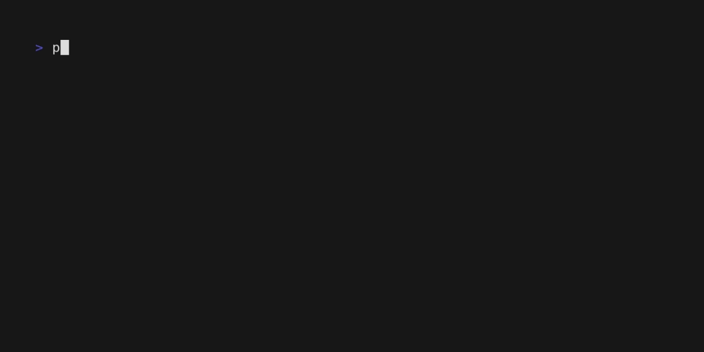
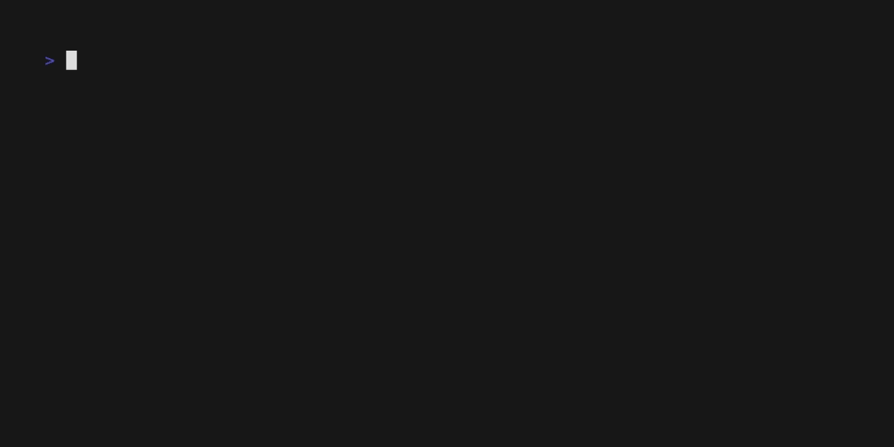

# Usage
На этой странице будет описано применение этого фреймворка.

## Events
Вы можете установить события при запуске или закрытии приложения.
Эти события могут быть полезны, например, при конфигурации приложения.

Эти события не принимают аргументов и ничего не возвращают.
```python
from eggella import Eggella

app = Eggella(__name__)


@app.on_startup()
def startup_1():
    print("startup 1")


@app.on_startup()
def startup_2():
    print("startup 2")


# These events activate if double press CTRL+C or type `exit` command

@app.on_close()
def close_1():
    print("close event 1")


@app.on_close()
def close_2():
    print("close event 2")


if __name__ == '__main__':
    app.loop()
```


## Set key, add description
По умолчанию, ключ команды берется из названия декорируемой функции. Если ключ нужно переназначить -
передайте первый аргумент ключа.

Чтобы добавить описание команды, вы можете передать параметр `short_description` или добавить
docstring в начале функции:

```python
from eggella import Eggella

app = Eggella(__name__)


@app.on_command("0echo")
def echo(*args):
    """print all passed arguments"""
    return " ".join(args)

if __name__ == '__main__':
    app.loop()
```


## Parse arguments
По умолчанию, ключи парсятся с помощью встроенной библиотеки [shlex](https://docs.python.org/3/library/shlex.html?highlight=shlex#shlex.split)
и конвертируются в типы на основе аннотаций:

```python
from eggella import Eggella

app = Eggella(__name__)


@app.on_command()
def hello(name: str):
    """print hello {name}"""
    return f"hello, {name}"

@app.on_command()
def div(a: int, b: int):
    """div two digits"""
    try:
        return a/b
    except ZeroDivisionError:
        return "ZeroDivisionError"

    
# this build-in function, need set key
@app.on_command("sum")  
def sum_(*digits: int):
    """sum all passed digits"""
    return sum(digits)

if __name__ == '__main__':
    app.loop()
```


> Вы можете передавать именованные аргументы, например `hello name="Georgiy"`

> В sum при передаче не числового аргумента программы вылетет с ошибкой.
> На этой странице в разделе [Error handle](#error-handle) будет разобран этот вопрос

## Default arguments
Вы можете указывать значения по умолчанию:

```python
from eggella import Eggella

app = Eggella(__name__)


@app.on_command()
def hello(name: str = "Anon"):
    return f"Hello, {name}"

```



> Если вы не передадите параметр name, то по умолчанию оно будет `"Anon"`

## Custom parse arguments handler
В некоторых случаях может не подойти стандартный обработчик аргументов.

В комплекте идет `RawCommandHandler`- игнорирует токенизацию аргументов и приведение типов, а
передает в функцию всю строку.

```python
from eggella import Eggella
from eggella.command import RawCommandHandler

app = Eggella(__name__)


@app.on_command(cmd_handler=RawCommandHandler())
def echo(command: str):
    return command


if __name__ == '__main__':
    app.loop()
```


Более тонкая настройка обработки будет в разделе `Advanced`

## Nested completer
Если необходимы дополнительные подсказки к командам и описания:

> в `nested_meta` для корректного вывода подсказок, ключи должны быть уникальные

```python
from eggella import Eggella
from eggella.command import RawCommandHandler

app = Eggella(__name__)


@app.on_command(
    cmd_handler=RawCommandHandler(),
    nested_completions={
        "proxy": {
            "socks": {"socks5://", "socks4://"},
            "http": {"https://", "http://"},
        },
        "timeout": {"0", "30", "60"},
        "render": {"spam", "egg", "foobar"},
    },
    nested_meta={
        "proxy": "set proxy",
        "socks": "usage SOCKS4/5 protocol",
        "http": "usage http(s) protocol",
        "timeout": "set request timeout",
        "render": "render a string object",
        "spam": "spammmm object",
        "egg": "wow! eggs!",
        "foobar": "rly? :O",
    },
)
def config(query: str):
    return f"Your answer: {query}"


if __name__ == '__main__':
    app.loop()
```


## Error handle

В разделе [Parse arguments](#parse-arguments) при передаче не числового аргумента в команды
`sum` и `div` - программа крашится с ошибкой. Вы можете создать обработчик ошибок для таких ситуаций

```python
from eggella import Eggella

app = Eggella(__name__)

@app.on_error(TypeError, ValueError)
def non_digit_handle(*args, **kwargs):
    return "ERROR! detect non digit argument"

@non_digit_handle
@app.on_command()
def div(a: int, b: int):
    """sum two digits"""
    try:
        return a/b
    except ZeroDivisionError:
        return "ZeroDivisionError"

    
@non_digit_handle
@app.on_command("sum")  
def sum_(*digits: int):
    """sum all passed digits"""
    return sum(digits)


if __name__ == '__main__':
    app.loop()
```



## App storage
Вы можете хранить переменные в хранилище приложения (это стандартный python словарь)
```python
from eggella import Eggella

app = Eggella(__name__)

@app.on_command()
def set_name(name: str):
    """Set name"""
    app.CTX["name"] = name

    
@app.on_command()
def hello():
    if name := app.CTX.get("name"):
        return f"Hello, {name}"
    return "Hello, Anon!"
```


## Shortcuts
В приложении имеются алиасы некоторых методов для уменьшения числа импортов из `prompt_toolkit` 
и они хранятся в `Eggella.cmd`

```python
from eggella import Eggella

from prompt_toolkit import HTML
from prompt_toolkit.validation import Validator
app = Eggella(__name__)


@app.on_command()
def color():
    """print red colored text"""
    # alias prompt_toolkit.print_formatted_text
    app.cmd.print_ft(HTML("<ancired>RED TEXT</ancired>"))

    
@app.on_command()
def digit_input():
    """invoke prompt_toolkit.prompt function"""
    # alias prompt_toolkit.prompt
    ans = app.cmd.prompt(">>> ", validator=Validator.from_callable(lambda s: s.isdigit()))
    return f"Your answer: {ans}"

@app.on_command()
def clear():
    """clear terminal output. If windows - invoke `cls`. Unix - `clear`"""
    app.cmd.clear()

    
if __name__ == '__main__':
    app.loop()
```


## FSM
FSM aka [Конечные автоматы](https://en.wikipedia.org/wiki/Finite-state_machine) 
предназначены для упрощения организации "ветвичной" логики программы.

```python
from typing import Optional

from prompt_toolkit.validation import Validator

from eggella import Eggella
from eggella.fsm import IntStateGroup


class LoginForm(IntStateGroup):
    EMAIL = 0
    PASSWORD = 1
    ACCEPT = 2


# prompt validators
password_validator = Validator.from_callable(lambda s: len(s) > 6 or s == "..",
                                             error_message="password len should be bigger than 6")

email_validator = Validator.from_callable(lambda s: "@" in s or s == "..",
                                          error_message="email is not valid")

confirm_validator = Validator.from_callable(lambda s: s in {"y", "n"})


app = Eggella(__name__)
app.register_states(LoginForm)


@app.on_command("auth")
def auth(email: Optional[str] = None, password: Optional[str] = None):
    """auth to service.

    if email and password not passed - invoke interactive auth
    """
    if email and password:
        print("Success auth!")
        print("Email:", email)
        print("Password:", "*" * len(password))
    else:
        app.fsm.run(LoginForm)


@app.on_state(LoginForm.EMAIL)
def email():
    result = app.cmd.prompt("Enter email > ", validator=email_validator)
    if result == "..":
        return app.fsm.finish()
    app.fsm.ctx["email"] = result
    app.fsm.next()


@app.on_state(LoginForm.PASSWORD)
def password():
    # alias from prompt_toolkit.prompt functon
    result = app.cmd.prompt("Enter password > ", is_password=True, validator=password_validator)
    if result == "..":
        return app.fsm.prev()
    app.fsm.ctx["password"] = result
    app.fsm.next()


@app.on_state(LoginForm.ACCEPT)
def finish():
    print("Your input:")
    print("email:", app.fsm["email"])
    print("if correct, type `y` or `n` for back prev step")
    confirm = app.cmd.prompt("(y/n)> ", validator=confirm_validator)
    if confirm == "n":
        return app.fsm.prev()
    auth(app.fsm["email"], app.fsm["password"])
    # don't forget to close FSM!
    app.fsm.finish()


if __name__ == '__main__':
    app.loop()

```


Разбор программы:

Чтобы добавить FSM надо:

1. Объявить класс, унаследовав Enum класс `IntStateGroup
2. Зарегистрировать класс состояний в приложении `app.register_states(...)`
3. Использовать декоратор `on_state(<IntStates.num>)` для вызова функций при заданном состоянии.

Описание:
- IntStateGroup - IntEnum класс для назначения состояний.

Методы взаимодействия:

- `app.fsm` - Доступ к менеджеру FSM состояний
- `app.fsm.run(<IntStates>)` - Запуск FSM с перового состояния
- `app.fsm.start(<IntStates.num>)` - Запуск FSM с заданного состояния
- `app.fsm.next()` - Переход на следующее состояние. Если это последние состояние - вызывает `finish`.
- `app.fsm.prev()` - Переход на предыдущее состояние. Если это первое состояние - вызывает `finish`.
- `app.fsm.set(<IntStates.num>)` - Переход на заданное состояние
- `app.fsm[<key>]` - Доступ к хранилищу значений текущего FSM
- `app.fsm.finish()` - Завершение FSM. **Все записанные значения в хранилище FSM удаляются автоматически.**

## Blueprints

В Eggella реализованы blueprints и идея схожа с 
[flask Blueprint](https://flask.palletsprojects.com/en/2.3.x/tutorial/views/#create-a-blueprint)

Вы можете разделять код или организовать систему плагинов

> bp_plugins.py
```python
from eggella import Eggella

# all app instances should be unique name
bp1 = Eggella("plugin 1")
bp2 = Eggella("plugin 2")

__all__ = ["bp1", "bp2"]


@bp1.on_startup()
def plugin_loaded():
    print("Plugin 1 loaded")


@bp1.on_command("plugin_1")
def cmd1():
    """this command from bp1 instance"""
    return "Plugin 1 command"


@bp2.on_startup()
def plugin_loaded2():
    print("Plugin 2 loaded")


@bp2.on_command("plugin_2")
def cmd2():
    """this command from bp2 instance"""
    return "Plugin 2 command"
```

> bp_main_app.py
```python
from eggella import Eggella

import bp_plugins


app = Eggella(__name__)
app.register_blueprint(
    bp_plugins.bp1, 
    bp_plugins.bp2
)


if __name__ == '__main__':
    app.loop()
```


### Замечания

- Ключи команд должны быть **уникальные**, если вы хотите изменять команды через
`register_blueprint()`, то можно отключить проверку:

```python
from eggella import Eggella

app = Eggella(__name__)
# enable overwrite commands from blueprints
app.overwrite_commands_from_blueprints = True

# app.register_blueprint()
```

- Из приложений, которые предаются в метод `register_blueprint()` регистрируются только следующие
события:
  - on_startup()
  - on_close()
  - on_command()
  - on_state()
